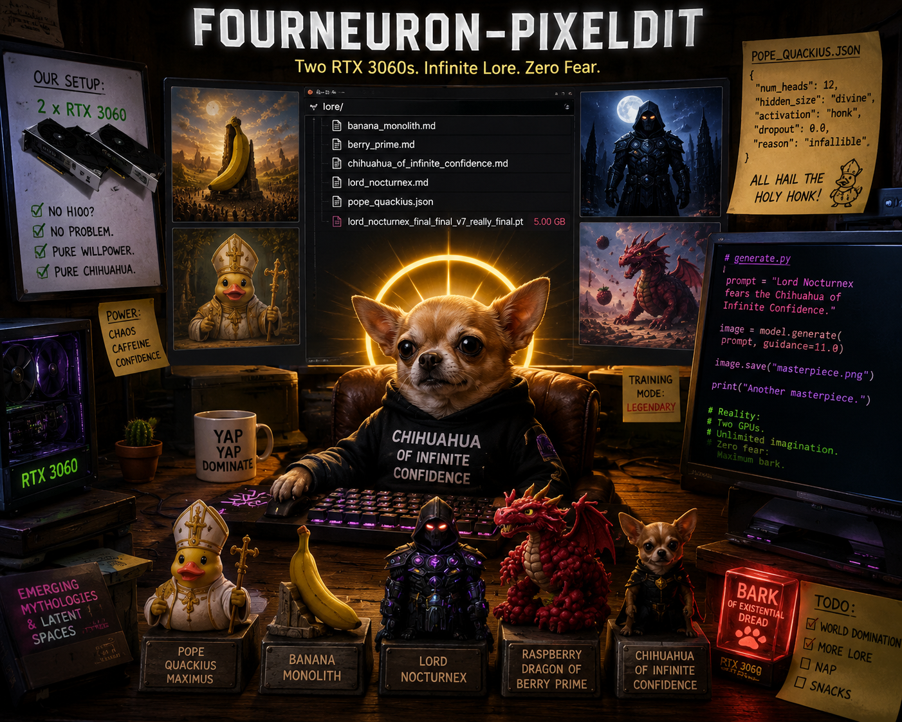

# PixelDiT 1.3B — Diffusers-Compatible Pipeline

> **Two RTX 3060s. Infinite Lore. Zero Fear.**

Unofficial HuggingFace diffusers-compatible conversion of NVIDIA's [PixelDiT-1300M-1024px](https://huggingface.co/nvidia/PixelDiT-1300M-1024px) with dual text encoder support (Gemma-2-2B + Qwen3-2B), LoRA training, and ComfyUI integration.

All credit for the model architecture and weights goes to NVIDIA Research. This repo provides the pipeline wrapper, Qwen encoder integration, LoRA tooling, and scripts.

> **I do not own this model.** Original weights, architecture, and training are the work of NVIDIA Research. For non-commercial use only (NSCLv1).

---

## What is PixelDiT?

PixelDiT is a 1.3B parameter **pixel-space** diffusion transformer — no VAE, generates images directly in pixel space. Runs on **4GB VRAM**.

- **Architecture**: MMDiT patch blocks + pixel pathway (PiT blocks)
- **Text encoders**: Gemma-2-2B (photorealistic) or Qwen3-2B (creative/fantasy)
- **Native resolution**: 1024×1024 (non-square supported)
- **Samplers**: Euler (default), Heun, LCM
- **Minimum steps**: 45–50 — below 45 produces garbage output
- **LoRA**: full PEFT-compatible LoRA training + inference

---

## Install

```bash
python3 -m venv .venv && source .venv/bin/activate
pip install torch --index-url https://download.pytorch.org/whl/cu121
pip install "diffusers>=0.31.0" "transformers>=4.40.0,<5.0.0" accelerate safetensors pillow peft
git clone https://github.com/madtunebk/pixeldit-diffusers
cd pixeldit-diffusers
python scripts/setup_diffusers_pixeldit.py
```

---

## Quick Start

```bash
# Gemma encoder (photorealistic, default)
python generate.py --prompt "a viking warrior on a cliff at sunset, cinematic"

# Portrait mode
python generate.py --height 1280 --width 768 --steps 60 --cfg 8.5 --prompt "your prompt"

# Qwen encoder (creative/fantasy)
python generate.py --encoder qwen --proj qwen_proj.pt --prompt "A giant hamster emperor in a battle fortress"

# With LoRA
python generate.py --lora lora_yarn_out/best --prompt "a dark anime woman in a field, yarn art style"

# LCM fast mode (8 steps)
python generate.py --scheduler lcm --steps 8 --cfg 2.0 --prompt "your prompt"
```

---

## Python API

```python
import torch
from transformers import AutoTokenizer, AutoModelForCausalLM
from diffusers.pipelines.pixeldit import PixelDiTPipeline

tokenizer = AutoTokenizer.from_pretrained("Efficient-Large-Model/gemma-2-2b-it")
tokenizer.padding_side = "right"
text_encoder = (
    AutoModelForCausalLM.from_pretrained("Efficient-Large-Model/gemma-2-2b-it", dtype=torch.bfloat16)
    .get_decoder().eval()
)

pipe = PixelDiTPipeline.from_pretrained(
    "madtune/pixeldit-diffusers",
    text_encoder=text_encoder,
    tokenizer=tokenizer,
    torch_dtype=torch.bfloat16,
)
pipe.enable_model_cpu_offload()

image = pipe(
    "a viking warrior on a cliff overlooking the stormy sea at sunset",
    negative_prompt="blurry, low quality, deformed, watermark",
    height=1024, width=1024,
    num_inference_steps=50,
    guidance_scale=7.5,
).images[0]
image.save("out.jpg")
```

---

## LoRA

### Train a style LoRA

```bash
# 1. Download images (Pexels API key required)
python scripts/download_unsplash.py --query "yarn wool textile" --n 150 --out /data/lora_yarn

# 2. Precompute embeddings
python scripts/precompute_lora_data.py --images /data/lora_yarn --out /data/lora_yarn_cache --trigger "yarn art style" --recaption

# 3. Train
python scripts/train_lora.py --data /data/lora_yarn_cache --out lora_yarn_out/ --epochs 50 --batch 2
```

### Load LoRA in pipeline

```python
pipe.load_lora_weights("lora_yarn_out/best")
pipe.set_adapters(["default"], adapter_weights=[1.0])

# merge multiple LoRAs
pipe.load_lora_weights("lora_style/best", adapter_name="style")
pipe.load_lora_weights("lora_char/best",  adapter_name="char")
pipe.set_adapters(["style", "char"], adapter_weights=[1.0, 0.7])

# bake into weights
pipe.fuse_lora()
```

---

## Qwen Encoder

> **Coming soon.** Qwen3-2B integration (creative/fantasy prompts) is implemented in the pipeline but projection training scripts are not yet released. Watch this repo for updates.

---

## ComfyUI

```bash
ln -s /path/to/pixeldit-diffusers/comfyui_pixeldit /path/to/ComfyUI/custom_nodes/comfyui_pixeldit
```

Three nodes under **PixelDiT** category:
- **PixelDiT Text Encoder** — load Gemma or any compatible encoder
- **PixelDiT Model Loader** — loads transformer from HF
- **PixelDiT Sampler** — prompt → image, all params exposed

---

## Scripts

| Script | Purpose |
|---|---|
| `generate.py` | Main generation script |
| `scripts/upscale_images.py` | RealESRGAN 4× upscale before LoRA precompute |
| `scripts/precompute_lora_data.py` | Precompute image+caption pairs for LoRA training |
| `scripts/train_lora.py` | LoRA fine-tuning |
| `scripts/download_unsplash.py` | Download images from Pexels by search query |
| `scripts/setup_diffusers_pixeldit.py` | Install pipeline into active venv's diffusers |

See `howto_lora.md` for the full LoRA training walkthrough.

---

## Credits

- **Original model & all credit**: [NVIDIA Research](https://huggingface.co/nvidia/PixelDiT-1300M-1024px)
- **Paper**: *PixelDiT: Pixel-Space Diffusion Transformers for Text-to-Image Generation* — NVIDIA
- **This repo**: unofficial diffusers conversion, Qwen integration, LoRA tooling only
